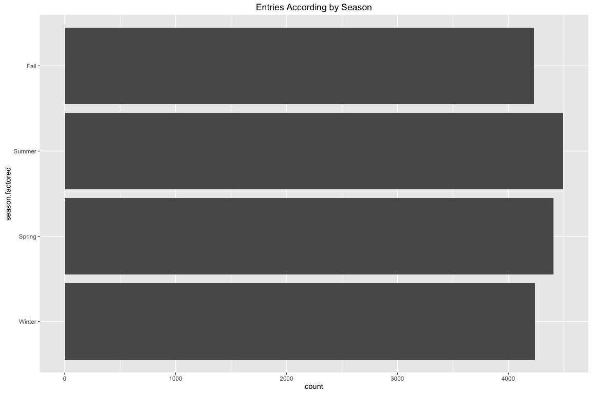
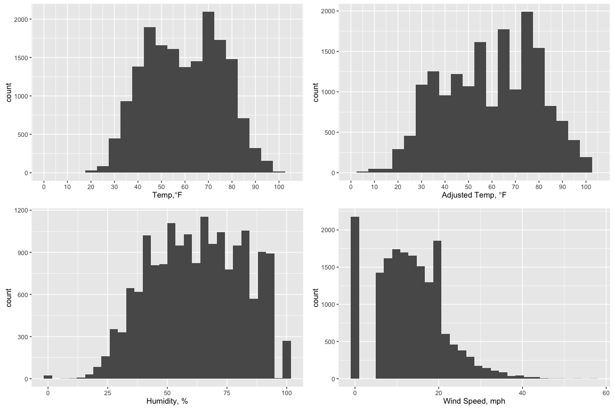
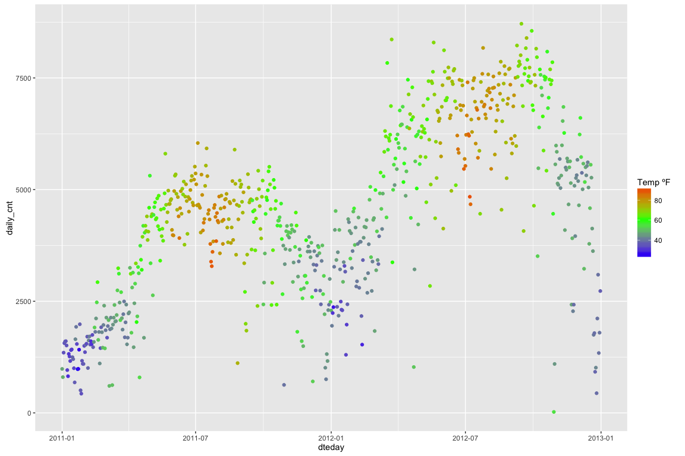
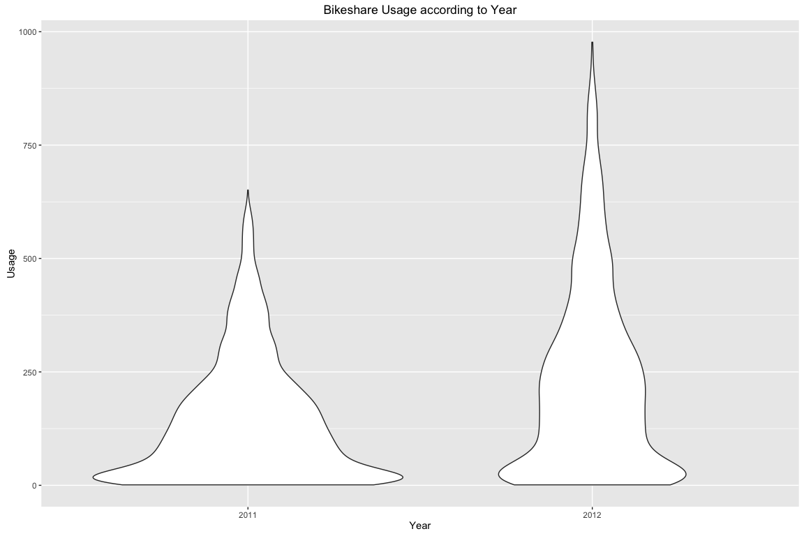

# Exploratory Data Analysis: Capital Bikeshare Program in Washington, D.C.
William Truong  
January 19, 2016  


# Introduction
Exploratory Data Analysis will be performed on a dataset describing the hourly
count of rental bikes between the years 2011 and 2012 for the Capital Bikeshare
Program in Washington, D.C. The dataset contains bike ridership information as
well as corresponding weather data.

Afterwards with the attributes provided, based on our analysis, we will create
a preliminary model to predict the number of bikeshare usage for a given hour
on a specific day.

## Summary of Dataset

        instant         dteday              season            yr              mnth              hr           holiday           weekday    
---  --------------  -----------------  --------------  ---------------  ---------------  --------------  ----------------  --------------
     Min.   :    1   Length:17379       Min.   :1.000   Min.   :0.0000   Min.   : 1.000   Min.   : 0.00   Min.   :0.00000   Min.   :0.000 
     1st Qu.: 4346   Class :character   1st Qu.:2.000   1st Qu.:0.0000   1st Qu.: 4.000   1st Qu.: 6.00   1st Qu.:0.00000   1st Qu.:1.000 
     Median : 8690   Mode  :character   Median :3.000   Median :1.0000   Median : 7.000   Median :12.00   Median :0.00000   Median :3.000 
     Mean   : 8690   NA                 Mean   :2.502   Mean   :0.5026   Mean   : 6.538   Mean   :11.55   Mean   :0.02877   Mean   :3.004 
     3rd Qu.:13034   NA                 3rd Qu.:3.000   3rd Qu.:1.0000   3rd Qu.:10.000   3rd Qu.:18.00   3rd Qu.:0.00000   3rd Qu.:5.000 
     Max.   :17379   NA                 Max.   :4.000   Max.   :1.0000   Max.   :12.000   Max.   :23.00   Max.   :1.00000   Max.   :6.000 

       workingday       weathersit         temp           atemp             hum           windspeed          casual         registered  
---  ---------------  --------------  --------------  ---------------  ---------------  ---------------  ---------------  --------------
     Min.   :0.0000   Min.   :1.000   Min.   :0.020   Min.   :0.0000   Min.   :0.0000   Min.   :0.0000   Min.   :  0.00   Min.   :  0.0 
     1st Qu.:0.0000   1st Qu.:1.000   1st Qu.:0.340   1st Qu.:0.3333   1st Qu.:0.4800   1st Qu.:0.1045   1st Qu.:  4.00   1st Qu.: 34.0 
     Median :1.0000   Median :1.000   Median :0.500   Median :0.4848   Median :0.6300   Median :0.1940   Median : 17.00   Median :115.0 
     Mean   :0.6827   Mean   :1.425   Mean   :0.497   Mean   :0.4758   Mean   :0.6272   Mean   :0.1901   Mean   : 35.68   Mean   :153.8 
     3rd Qu.:1.0000   3rd Qu.:2.000   3rd Qu.:0.660   3rd Qu.:0.6212   3rd Qu.:0.7800   3rd Qu.:0.2537   3rd Qu.: 48.00   3rd Qu.:220.0 
     Max.   :1.0000   Max.   :4.000   Max.   :1.000   Max.   :1.0000   Max.   :1.0000   Max.   :0.8507   Max.   :367.00   Max.   :886.0 

## What the Dataset Looks Like

```
##    instant     dteday season yr mnth hr holiday weekday workingday
## 1        1 2011-01-01      1  0    1  0       0       6          0
## 2        2 2011-01-01      1  0    1  1       0       6          0
## 3        3 2011-01-01      1  0    1  2       0       6          0
## 4        4 2011-01-01      1  0    1  3       0       6          0
## 5        5 2011-01-01      1  0    1  4       0       6          0
## 6        6 2011-01-01      1  0    1  5       0       6          0
## 7        7 2011-01-01      1  0    1  6       0       6          0
## 8        8 2011-01-01      1  0    1  7       0       6          0
## 9        9 2011-01-01      1  0    1  8       0       6          0
## 10      10 2011-01-01      1  0    1  9       0       6          0
##    weathersit temp  atemp  hum windspeed casual registered cnt
## 1           1 0.24 0.2879 0.81    0.0000      3         13  16
## 2           1 0.22 0.2727 0.80    0.0000      8         32  40
## 3           1 0.22 0.2727 0.80    0.0000      5         27  32
## 4           1 0.24 0.2879 0.75    0.0000      3         10  13
## 5           1 0.24 0.2879 0.75    0.0000      0          1   1
## 6           2 0.24 0.2576 0.75    0.0896      0          1   1
## 7           1 0.22 0.2727 0.80    0.0000      2          0   2
## 8           1 0.20 0.2576 0.86    0.0000      1          2   3
## 9           1 0.24 0.2879 0.75    0.0000      1          7   8
## 10          1 0.32 0.3485 0.76    0.0000      8          6  14
```

## Structure

```
## 'data.frame':	17379 obs. of  17 variables:
##  $ instant   : int  1 2 3 4 5 6 7 8 9 10 ...
##  $ dteday    : chr  "2011-01-01" "2011-01-01" "2011-01-01" "2011-01-01" ...
##  $ season    : int  1 1 1 1 1 1 1 1 1 1 ...
##  $ yr        : int  0 0 0 0 0 0 0 0 0 0 ...
##  $ mnth      : int  1 1 1 1 1 1 1 1 1 1 ...
##  $ hr        : int  0 1 2 3 4 5 6 7 8 9 ...
##  $ holiday   : int  0 0 0 0 0 0 0 0 0 0 ...
##  $ weekday   : int  6 6 6 6 6 6 6 6 6 6 ...
##  $ workingday: int  0 0 0 0 0 0 0 0 0 0 ...
##  $ weathersit: int  1 1 1 1 1 2 1 1 1 1 ...
##  $ temp      : num  0.24 0.22 0.22 0.24 0.24 0.24 0.22 0.2 0.24 0.32 ...
##  $ atemp     : num  0.288 0.273 0.273 0.288 0.288 ...
##  $ hum       : num  0.81 0.8 0.8 0.75 0.75 0.75 0.8 0.86 0.75 0.76 ...
##  $ windspeed : num  0 0 0 0 0 0.0896 0 0 0 0 ...
##  $ casual    : int  3 8 5 3 0 0 2 1 1 8 ...
##  $ registered: int  13 32 27 10 1 1 0 2 7 6 ...
##  $ cnt       : int  16 40 32 13 1 1 2 3 8 14 ...
```

## Dimensions

```
## [1] 17379    17
```

## Description of Attributes
From [UCI's Machine Learning Repository][1]:

- *instant*: Record index
- *dteday*: Dates from 2011-01-01 to 2012-12-31
- *season*: (1:spring, 2:summer, 3:fall, 4:winter)
- *yr* : year (0: 2011, 1:2012)
- *mnth* : month ( 1 to 12)
- *hr* : hour (0 to 23)
- *holiday* : whether day is holiday or not
- *weekday* : day of the week
- *workingday* : if day is neither weekend nor holiday is 1, otherwise is 0.
- *weathersit* : 
    - 1: Clear, Few clouds, Partly cloudy, Partly cloudy
    - 2: Mist + Cloudy, Mist + Broken clouds, Mist + Few clouds, Mist
    - 3: Light Snow, Light Rain + Thunderstorm + Scattered clouds, Light Rain +
         Scattered clouds
    - 4: Heavy Rain + Ice Pallets + Thunderstorm + Mist, Snow + Fog
- *temp* : Normalized temperature in Celsius. The values are derived via
           (t-t_min)/(t_max-t_min), t_min=-8, t_max=+39 (only in hourly scale)
- *atemp*: Normalized feeling temperature in Celsius. The values are derived
           via (t-t_min)/(t_max-t_min), t_min=-16, t_max=+50
           (only in hourly scale)
- *hum*: Normalized humidity. The values are divided to 100 (max)
- *windspeed*: Normalized wind speed. The values are divided to 67 (max)
- *casual*: count of casual users
- *registered*: count of registered users
- *cnt*: count of total rental bikes including both casual and registered

[1]: https://archive.ics.uci.edu/ml/datasets/Bike+Sharing+Dataset

## Convert Attributes into Factors
For visualization purposes, let's convert the following attributes into factors

- hr
- weathersit
- holiday
- workingday
- weekday
- season
- mnth
- yr


```r
setDT(wd)
# Also convert dteday to the Posix Date format
wd[, date:=ymd_hms(with(wd, paste(dteday, " ", hr,":00:00", sep="")), 
                   tz="EST")]
wd[, dteday:=as.Date(dteday)] 
wd[, hr.factored:=factor(hr)]
wd[, weathersit.factored:=factor(weathersit, levels=c(1,2,3,4),
                       labels=c("Ideal", "Good", "Bad", "Poor"))]
wd[, holiday.factored:=factor(holiday, labels=c("Regular Day", "Holiday"))]
wd[, workingday.factored:=factor(workingday, labels=c("Weekend or Holiday",
                                                      "Working Day"))]
wd[, weekday.factored:=factor(weekday, levels=c(0,1,2,3,4,5,6),
                    labels=c("SU","M","T","W","TH","F","S"))]
wd[, season.factored:=factor(season, levels=c(1,2,3,4),
                   labels=c("Spring","Summer","Fall","Winter"))]
wd[, mnth.factored:=factor(mnth)]
wd[, yr.factored:=factor(yr, levels=c(0,1), labels=c(2011,2012))]
```

# Quick Look at the Bikeshare Ridership

Plotting bikeshare ridership per hour for the years 2011 - 2012 already show
some interesting relationships and trends:

- The plot shows an increasing trend year over year.
- There is a cyclical trend in bikeshare usage, peaking in the summer while
dipping in the winter.
- A wide range exists between low usage hours and high usage hours.

# Univariate Analysis

## Bikeshare Usage Attributes


Bikeshare usage as a whole follows a Poisson distribution. There are more
registered users than casual users. Casual users are lower
in bikeshare usage for a given hour than registered users.


## Factored Attributes

### Seasons


According to the dataset description, the following mappings for the seasons
are: (1:spring, 2:summer, 3:fall, 4:winter). If that was the case, then spring
and summer should have slightly more entries than fall and winter, which leads
to the suspicion that seasons are labeled incorrectly. We can check this by
plotting the previous plot and coloring by season.


Looks like the seasons are off by one. Let's address this and redraw the plots.

Seasons are now correctly labeled.

Since we are looking at the full calendar year of 2011 and 2012, the
distribution of seasons are almost uniform. Seasons are an indicator of changes
in temperature pattern, and may prove of use as a feature. However since we 
have months, the season attribute may not be as useful.

### Weekdays, Weekends, Working Days, and Holidays


```r
prop.table(table(wd$workingday.factored))
```

```
## 
## Weekend or Holiday        Working Day 
##          0.3172795          0.6827205
```

The first bar plot shows an expected small percentage of holiday entries. As
for the second bar plot, approximately 32% percent of the days are holidays or
weekends and 68% working days.

Table of days that are holidays:

```
##         dteday
##  1: 2011-01-17
##  2: 2011-02-21
##  3: 2011-04-15
##  4: 2011-05-30
##  5: 2011-07-04
##  6: 2011-09-05
##  7: 2011-10-10
##  8: 2011-11-11
##  9: 2011-11-24
## 10: 2011-12-26
## 11: 2012-01-02
## 12: 2012-01-16
## 13: 2012-02-20
## 14: 2012-04-16
## 15: 2012-05-28
## 16: 2012-07-04
## 17: 2012-09-03
## 18: 2012-10-08
## 19: 2012-11-12
## 20: 2012-11-22
## 21: 2012-12-25
##         dteday
```


### Weather Conditions


```
## [1] "Distribution of Weather Conditions."
```

```
## 
##            1            2            3            4 
## 0.6567121238 0.2614649865 0.0816502676 0.0001726221
```
66% of the days are clear (Ideal), 26% partly cloudy (Good), and
8% rainy/snowy/foggy weather (Bad + Poor). Bad and poor weather conditions may
exhibit a negative correlation with bikeshare usage.

## Histograms of Weather Reading Attributes

```
## [1] "Denormalized Temperature Summary, Farenheit"
```

```
##    Min. 1st Qu.  Median    Mean 3rd Qu.    Max. 
##   19.00   46.00   60.00   59.66   73.00  102.00
```

```
## [1] "Denormalized Adjusted Temperature Summary, Farenheit"
```

```
##    Min. 1st Qu.  Median    Mean 3rd Qu.    Max. 
##    3.00   43.00   61.00   59.72   77.00  122.00
```

```
## [1] "Denormalized Humidity Summary"
```

```
##    Min. 1st Qu.  Median    Mean 3rd Qu.    Max. 
##    0.00   48.00   63.00   62.72   78.00  100.00
```

```
## [1] "Denormalized Windspeed Summary"
```

```
##    Min. 1st Qu.  Median    Mean 3rd Qu.    Max. 
##   0.000   7.002  13.000  12.740  17.000  57.000
```



Note: The weather attributes above have been denormalized to their appropriate
values.

### Temperature
The measured temperature in Washington, D.C. exhibits a bimodal distribution,
indicating that there are 4 seasons.

### Adjusted Temperature
Compared to the measured temperature, adjusted temperature has more
spread out measurements. Adjusted temperature readings are a function of
temperature, humidity, precipitation, and windspeed, and because of this I
hypothesize that this attribute will have the most correlation with bikeshare
usage.

### Humidity
There is great variation in humidity. I assume it will also correlate with
bikeshare usage.

### Windspeed
Majority of windspeed temperature lies between 7 mph and 17 mph. This low
variation suggests that it will not affect bikeshare usage drastically. Outliers
in windspeed also indicate unfavorable weather conditions, which is what the
weathersit attribute attempts to capture.

### Summary
In regards to weather readings, I hypothesize that the adjusted temperature 
readings will capture most of the correlation with bikeshare usage due to it
being a function of temperature, humidity, and windspeed. However, with
temperature, humidity and windspeed present, there might not be a need to
include adjusted temperature in the model.

## Average and Hourly Weather Conditions over Time
### Temperature


Looks like Washington, D.C. experiences the typical four seasons according to
the temperature plots above. Feeling temperature has much more variability than
actual temperature. It is quite possible that bikeshare usage may be more
correlated with feeling temperature.

There also seems to be an anomaly in reading the feeling temperature between
2012-07 and 2012-10 where one or more temperature readings are much lower than
the norm. Although it might not make a difference while calculating correlation,
it's better to remove that observation from our dataset.

Adjusted temperature plot after anomaly has been removed:

```r
# Find the date where the anomaly occurs
unique(wd[wd$dteday > as.Date("2012-07-01") &
          wd$dteday < as.Date("2012-10-01") &
          wd$atemp.denormed < 37, .(dteday)])
```

```
##        dteday
## 1: 2012-08-17
```

```r
# Check if atemp is bad for the whole day
wd[wd$dteday == as.Date("2012-08-17"), .(temp.denormed, atemp.denormed)]
```

```
##     temp.denormed atemp.denormed
##  1:            75             32
##  2:            73             32
##  3:            73             32
##  4:            72             32
##  5:            72             32
##  6:            72             32
##  7:            70             32
##  8:            72             32
##  9:            75             32
## 10:            77             32
## 11:            80             32
## 12:            82             32
## 13:            87             32
## 14:            89             32
## 15:            90             32
## 16:            90             32
## 17:            89             32
## 18:            87             32
## 19:            87             32
## 20:            80             32
## 21:            79             32
## 22:            75             32
## 23:            73             32
## 24:            72             32
##     temp.denormed atemp.denormed
```

```r
# atemp is bad for the whole day, so replace with temp values
my_temp <- wd[wd$dteday == as.Date("2012-08-17")]$temp
my_temp.denormed <- wd[wd$dteday == as.Date("2012-08-17")]$temp.denormed
                    
wd[wd$dteday == as.Date("2012-08-17"), atemp := my_temp]
wd[wd$dteday == as.Date("2012-08-17"), atemp.denormed := my_temp.denormed]


ggplot(wd,aes(x=date, y=atemp.denormed)) + 
  geom_point(aes(colour=atemp.denormed)) +
  scale_colour_gradient2(name="Temp ºF", low = "blue", mid = "green" ,
                         high = "red", midpoint = 60) + 
  geom_smooth(color = "red",size = 1) +
  scale_y_continuous(breaks=seq(0,125,25)) +
  ggtitle ("Hourly Feeling Temperature") +
  xlab("Date") +  ylab ("Hourly Feeling Temperature ( ºF )")
```


### Humidity


There is huge variation in humidity on a daily basis, with an upward trend in
humidity starting in the summer and downward trend starting around mid autumn.

### Windspeed


Windspeed also varies on a daily basis, with an upward trend in windspeed during
Winter and Spring and a downward trend in Summer and Fall.
There are also some days with windspeed greater than 50 mph. 

### Summary

We have analyzed bikeshare usage against temperature, adjusted temperature,
humidity, and windspeed in great detail for Washington, D.C. over a period of
two years. It will be interesting later on to see how these attributes affect
bikeshare usage with a daily average or when attributes such as time of day and
day of the week are fixed.

# Multivariate Analysis

Here we will analyze what role suspected attributes have with bikeshare usage.
Since temperature was just discussed in great detail, let's start off with
looking at hourly bikeshare usage and weather.

##  Bikeshare Usage and Weather
### Temperature

It's too hard to tell what's going on with these plots except the observation
that bike share usage increases as temperature reaches to about 80 degrees
Farenheit. There is a relatively lesser amount of bikeshare usage when temperatures
drop below 50 degrees.

A better picture may be formed if we use violin plots with specific temperature
intervals.


temp.denormed.bucket    count
---------------------  ------
[0,30)                    331
[30,60)                  7998
[60,90)                  8692
[90,120)                  358


atemp.denormed.bucket    count
----------------------  ------
[0,30)                    1190
[30,60)                   7139
[60,90)                   7969
[90,120)                  1081

We can see with the tables that feeling temperature is more weighted towards 
really cold and really hot temperatures. Distributions between the two 
temperature attributes seem similar. For both plots, at the coldest 
temperatures there is a lower amount of bikeshare usage, and there is 
suprisingly a higher amount of bikeshare usage. This may coincide with the
fact that colder temperature are associated with winter, when people are on
holiday break, and also with the early AM hours, where hotter temperature 
coincides with the summer break when kids are out of school. Further analysis 
may need to be done with hours fixed to eliminate confounding variables.

On a macro level, let's see what happens when we plot daily bikeshare usage 
against time and color by mean temperature.



With the presented plot, we can see that temperature is highly correlated with
the daily number of bikeshare usage. Bikeshare increases with warmer
temperatures and then slightly decreases when temperatures exceed 80 degrees
Farenheit, which also indicates a nonlinear relationship.

### Humidity

For humidity we need to plot it independent from temperature changes and time.


Bikeshare usage decreases as humidity increases.

### Windspeed

For windspeed the values for which wind is measured are stored in floats. To 
get a more accurate picture, windspeed measurements will be put in groups of
10 mph when plotted.


wind.denormed.bucket    count
---------------------  ------
[0,10)                   6960
[10,20)                  8016
[20,30)                  1739
[30,40)                   601
[40,50)                    55
[50,60)                     8

As windspeeds exceed 30 mph, there is a downward trend in bikeshare usage.
However, the number of occurences where windspeed exceed 40 mph might be too
few to make any statements about trend. 

### Weather Conditions


weathersit.factored    count
--------------------  ------
Ideal                  11413
Good                    4544
Bad                     1419
Poor                       3

There are identical distributions for ideal and good weather conditions. When
weather conditions are bad, the distribution compresses into bikeshare usage
under 250. There are too few poor weather conditions to be any significant,
but we can assume it would be similar to bad weather conditions.

### Season


Distributions are identical for the seasons except Winter. In Winter decreased
bikeshare usage may be the result of the holidays and colder temperatures.

## Time Attributes

The shape of the distribution for 2012 changed drastically due to growth in the
system, indicating that there is growth due to demand and popularity 
independent of weather conditions.


Months give a finer resolution of how seasons affect bikeshare usage.


By taking a look at the variance in ridership for each of the hours we can see
that there are definitely factors that contribute to ridership for each hour.
There are two peak times, 8am and 5pm. The users using the bikeshare program at
this time are probably people working in the city.


By faceting between whether it's a working day or not, we have identified that
different peak times exist.


Bikeshare usage for the days of the week can be seperated by weekends and
weekdays, which reaffirms the use of the workingday attribute.

## Conditional Attributes:


In the dataset there are two variables: holiday and workingday. Holiday
indicates whether the day is a holiday or not. Workingday indicates whether it
is a working day or not. As we can see in the plots above, there is a decrease
in bikeshare usage if it is a holiday. There is also a decrease in bikeshare
ridership if it is not a working day.

To get a better look at how the weekend by itself effects bikeshare usage,
let's combine the two attributes into an attribute called type_of_day with the
following mappings:

* 0: Holiday
* 1: Weekend
* 2: Working day


Holidays show slightly less bikeshare usage than weekends, but it may not
be enough to be significant. There seems to be more bikeshare usage on
working days.

# Wrapping It All Up Analytically

Random forest will be used to find the relationship between bikeshare usage and
the given attributes, due to the observed sinusoidal relationships seen in the
analysis.

The year, month, hour, type of day (holiday, weekend, or working day),
temperature, humidity, and windspeed will be used as features.

Only one temperature attribute will be used because the two temperature
attributes are highly correlated with each other. More rigorous feature
selection can be done later on to determine what is better suited.

## Random Forest Feature Importance


What stands out here is that the year attribute is very important by random
forest. This validates the previous observation that bikeshare usage is
growing in the number of registered and casual users year over year.
Let's see if that changes the importance of the relationship between
attributes and bikeshare usage.


We can see that for both years, hour and temperature play a big role in
bikeshare usage. In 2012, temperature seems to play more of a role in bikeshare
useage. The importance of type of day is also stronger in 2012. This may
suggest a change in trends due to the increased bikeshare usage in 2012.

# Final Plots and Summary


Bikeshare usage is most affected by the hour of the day. There are more people
using the bikeshare program during rush hour on the weekdays and around the
afternoon on the weekends.


The year over year system growth in bikeshare usage going from 2011 to 2012
increased significantly. What is also interesting is that the distribution
for the years 2011 and 2012 are very different, with 2012 seeing more users on
average as well as higher outlier numbers.


Temperature is also one of the major factors influencing bikeshare usage. There
is a lower number of bikeshare usage when around freezing temperatures,
suggesting that it may be too cold and a bit dangerous using the bike during
those circumstances. Hot weather doesn't seem to affect bikeshare usage, but
it definitely does not encourage an increase in usage, relative to warm
temperatures.

Overall, it seems that the Capital Bikeshare program is increasing in usage,
and that it is being used by the community for both commuting and for leisure.
Something to keep an eye out for would be the increasing growth rate, which
would mean that more bikes will be needed to bought to keep up. It would be
interesting to see how bikeshare programs in other cities with different
climates compare with Capital Bikeshare program's success.

# Reflection
I chose to investigate the Capital Bikeshare program to solidify my
understanding of analyzing attributes for the purpose of linear regression
analysis. What I didn't expect at the beginning was the cyclical patterns that
exist in multiple attributes. I started off with using linear models in the
beginning to find relationships, but I quickly learned that it was not the
model of choice for a feature set that has cyclical patterns. Through some 
research and due diligence I discovered that random forest was a quick way
to find correlations between bikeshare usage and the given attributes.
Another time consuming lesson that I learned was that it is important to
narrow what you want to explore to make it possible to finish this project.

## Further Exploration

* Investigate what the cause is for the outliers in bikeshare usage. Could it 
  be a huge event, parade, or concert. Is it due to peak tourist season?
* Use other types of supervised learning to get the most out of the attributes
  given.
* Find out what the different relationships are between bikeshare usage and the
  given features, when seperated by year.
* Find out how casual users affect the behavior of registered users, since
  casual users over time convert to registered users.
* Eliminate attributes that aren't important in determining bikeshare usage to
  see if better relationships can be shown through Random Forest.


