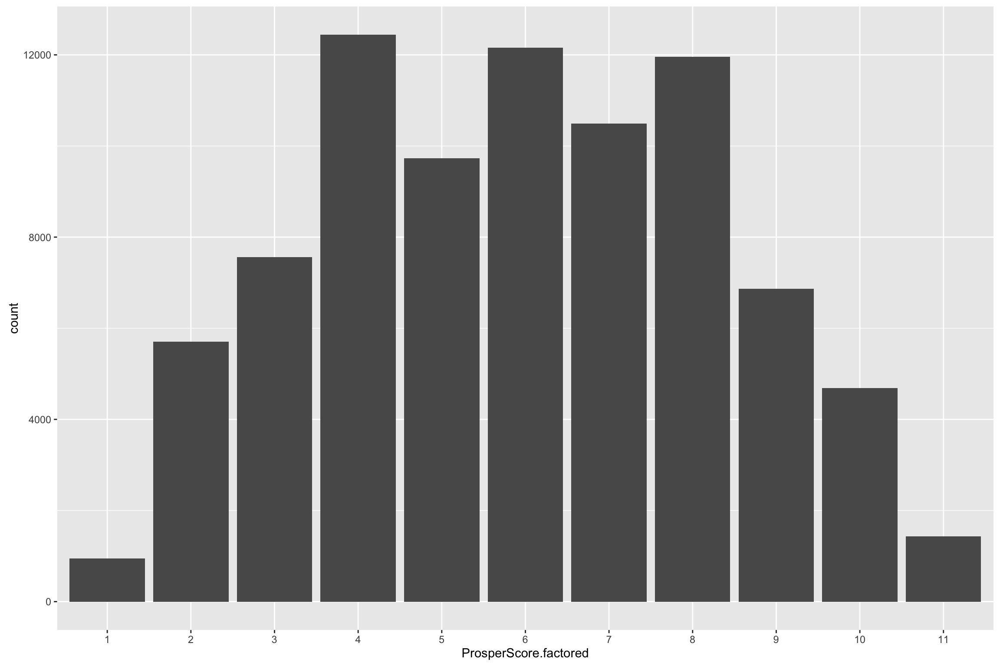
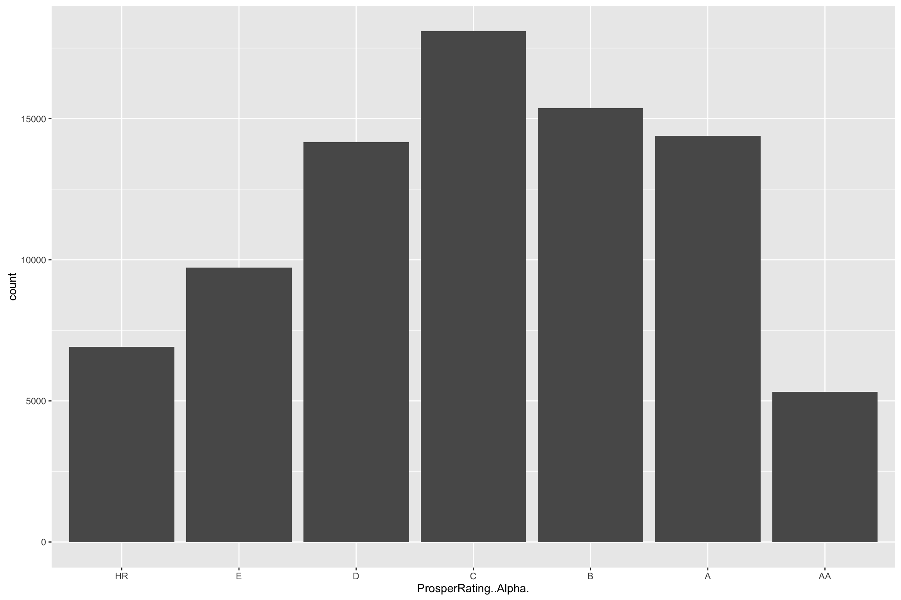
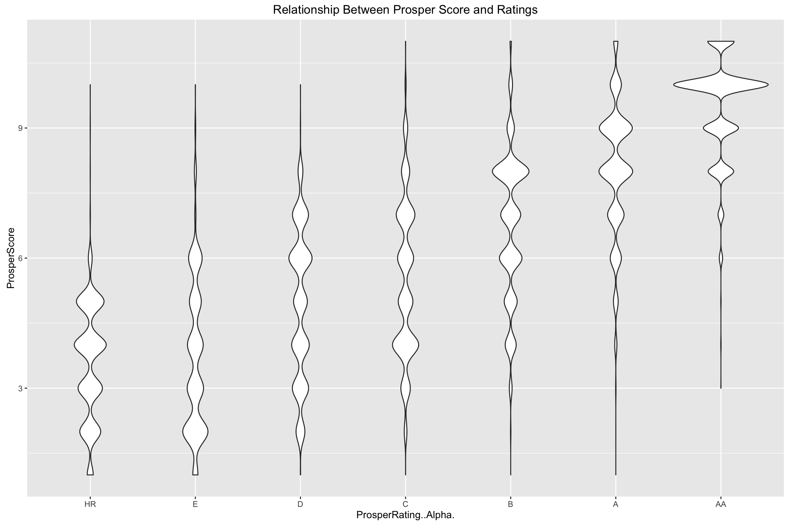
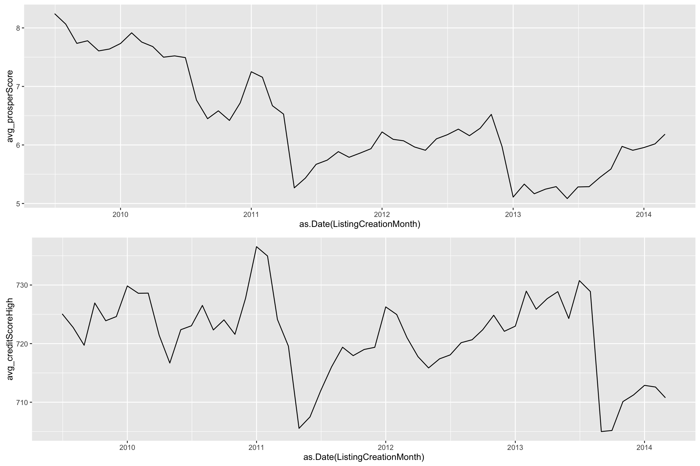
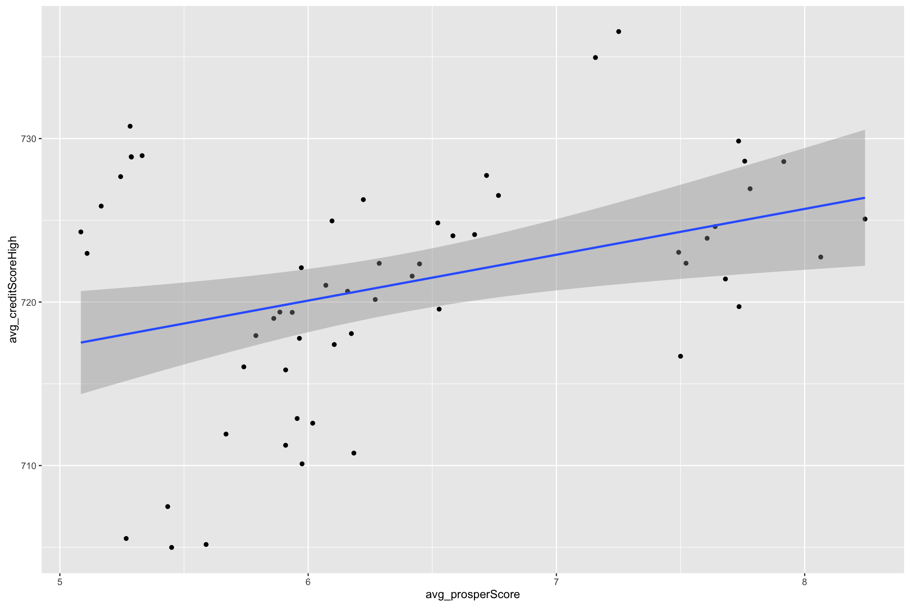

# 1_EDA_Prosper_Loan_Data


## How are Prosper Scores and Prosper Ratings related?
### Prosper Score
A custom risk score that was built using historical Prosper data to assess the risk of Prosper borrower listings. 

#### Distribution


### Prosper Rating
Prosper Ratings allow investors to consider a loan’s level of risk because the rating represents an estimated average annualized loss rate range. According to the company, that figure is "determined by two scores: (1) the credit score, obtained from an official credit reporting agency, and (2) the Prosper Score, figured in-house based on the Prosper population." Prosper Ratings, from lowest-risk to highest-risk, are labeled AA, A, B, C, D, E, and HR ("High Risk").

#### Distribution

```r
ggplot(data=prosper_df, aes(ProsperRating..Alpha.)) +
     geom_bar()
```




```r
ggplot(data=prosper_df, aes(x=ProsperRating..Alpha., y=ProsperScore)) + geom_violin() +
  ggtitle("Relationship Between Prosper Score and Ratings")
```



## Prosper Loans Throughout Time

```r
prosper_df.prosperScoreByMonth <- prosper_df %>% group_by(ListingCreationMonth) %>%
                                  summarise(avg_prosperScore=mean(ProsperScore),
                                            avg_creditScoreHigh=mean(CreditScoreRangeUpper)) %>%
                                  ungroup()

p1 = ggplot(prosper_df.prosperScoreByMonth, aes(x=as.Date(ListingCreationMonth))) + 
         geom_line(aes(y=avg_prosperScore))

p2 = ggplot(prosper_df.prosperScoreByMonth, aes(x=as.Date(ListingCreationMonth))) + 
         geom_line(aes(y=avg_creditScoreHigh))

grid.arrange(p1,p2)
```



## Bivariate Analysis

```r
ggplot(prosper_df.prosperScoreByMonth, aes(x=avg_prosperScore, y=avg_creditScoreHigh)) + geom_point() + geom_smooth(method="lm")
```



Looks like there is very little correlation between the Prosper Score and Credit Score.
